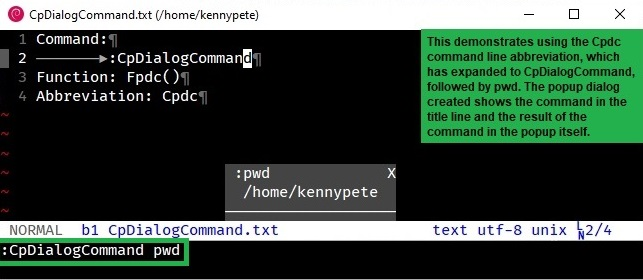
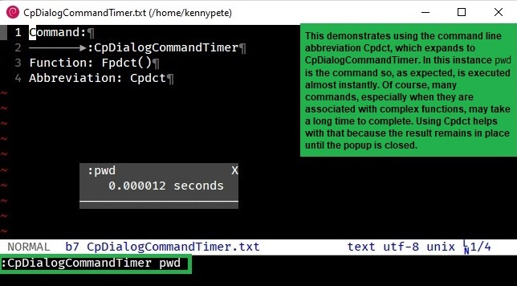
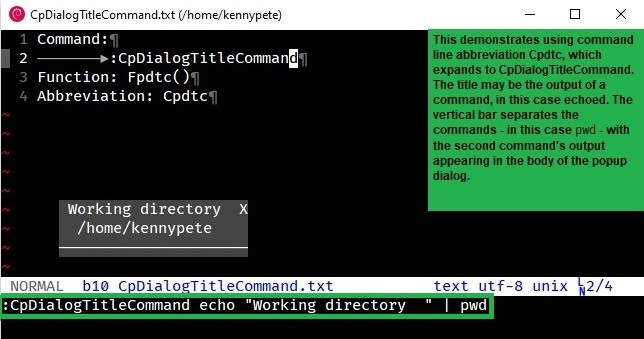
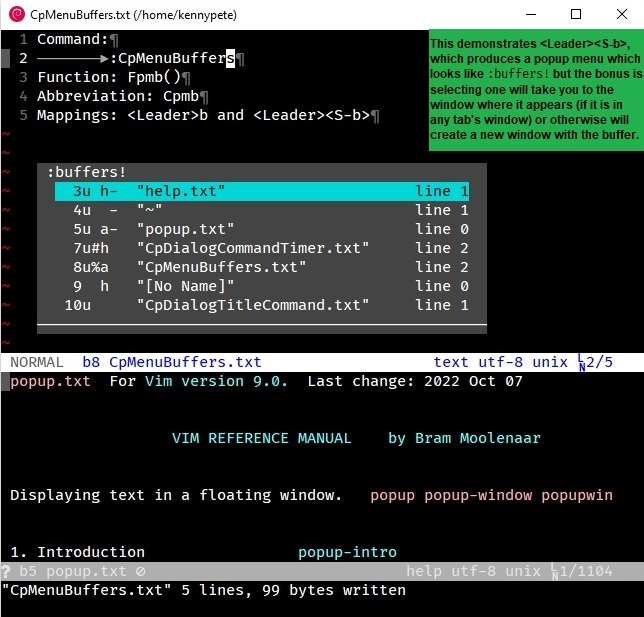
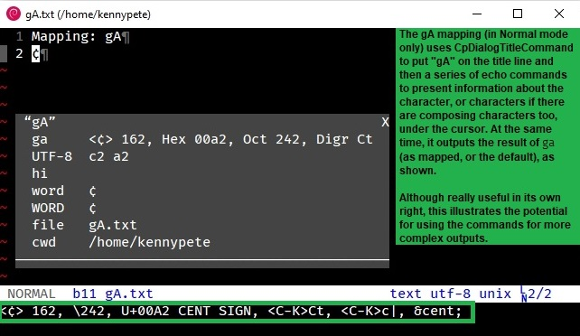

= vim-popped
:author: Peter Kenny
:doctype: article
:icons: font
:pdf-theme: D:\git.kennypete\asciidoc\adoc\pdf\README-theme.yml
:sectnums:
//"experimental" is needed for kbd:[], which is NOT experimental
:experimental:
:toc: preamble
//there's no need for a toc title in GitHub/HTML, but in PDF there is
ifndef::backend-html5,env-github[:toc-title: Contents]
ifdef::backend-html5,env-github[:toc-title:]
//only two levels of toc in this README so ....
ifndef::backend-html5,env-github[:toclevels: 2]
ifdef::backend-html5,env-github[:toclevels: 2]
//Admonitions are unsatisfying on GitHub: they are not prominent and
//are too small. There seems to be no solution to that?
ifdef::env-github[]
:important-caption: :heavy_exclamation_mark:
:tip-caption: :bulb:
:note-caption: :information_source:
:caution-caption: :fire:
:warning-caption: :warning:
endif::env-github[]
// Refs to vimhelp.org:
:h: https://vimhelp.org/
// :attributes: only use lowercase, numerals, and hyphens.
// NB: asciidoctor-pdf-2.3.7 processes uppercase literally, so don't use
// uppercase.
// Refer -
// https://docs.asciidoctor.org/asciidoc/latest/attributes/names-and-values/
:h-ascii: {h}various.txt.html#%3Aascii
:h-builtin-functions: {h}builtin.txt.html#builtin-functions
:h-cnoreabbrev: {h}map.txt.html#%3Acnoreabbrev
:h-digraphs: {h}digraph.txt.html#3Adigraphs
:h-expand: {h}builtin.txt.html#expand%28%29
:h-g8: {h}various.txt.html#g8
:h-getcwd: {h}builtin.txt.html#getcwd%28%29
:h-has: {h}builtin.txt.html#has%28%29
:h-highlight-group: {h}syntax.txt.html#highlight-groups
:h-normal: {h}intro.txt.html#Normal-mode
:h-packadd: {h}repeat.txt.html#pack-add
:h-packpath: {h}options.txt.html#%27packpath%27
:h-packages: {h}repeat.txt.html#packages
:h-popup-functions: {h}popup.txt.html#popup-functions
:h-popup-intro: {h}popup.txt.html#popup-intro
:h-popup-setoptions: {h}popup.txt.html#popup_setoptions%28%29
:h-popup-window: {h}version8.txt.html#new-popup-window
:h-statusmsg: {h}eval.txt.html#v%3Astatusmsg
:h-version9: {h}version9.txt.html#version9.txt
:h-vim-802: {h}version8.txt.html#vim-8.2
:h-vimrc: {h}starting.txt.html#%2Evimrc
:h-vim9-mix: {h}vim9.txt.html#vim9-mix
:h-vim9-script: {h}vim9.txt.html#Vim9-script
:h-vversion: {h}eval.txt.html#v%3Aversion
:h-unlisted-buffer: {h}windows.txt.html#unlisted-buffer
:h-word: {h}motion.txt.html#word
:h-word-uc: {h}motion.txt.html#WORD

// Abstract (block) works best for the intro paragraph between the article
// title and the Installation section.
// https://docs.asciidoctor.org/asciidoc/latest/sections/abstract-block/
// For GitHub it is superfluous
ifndef::backend-html5,env-github[[abstract]]
--

'''

This plugin provides four commands that use Vim&#x2019;s
{h-builtin-functions}[builtin] {h-popup-window}[popup window] functionality.
Vim&#x2019;s {h-popup-intro}[popup-intro] provides examples of
when you may want to use popup windows, so that is not explained here.
The <<screenshots>> and <<mappings>> illustrate how to use the commands, and
ways they may be useful.

// Asciidoc footnotes can be challenging in github - they work best when
// kept as contiguous text, which is an exception to my Asciidoc files
// generally, which I keep to <80 characters per line.
_Compatibility_: vim-popped is built primarily for {h-version9}[Vim 9].footnote:[This plugin has been built with both {h-vim9-script}[vim9script] and vimscript functions.  The main script, in vim-popped/plugins/vim-popped.vim, uses {h-vim9-mix}[vim9-mix] capability, determining the script version based on {h-vversion}[v:version] and {h-has}[has()], testing for 8.2 and patch &gt;&#x3D;4057.  If 8.2 and patch &lt;4057, but &gt;&#x3D;3434, vimscript functions/commands are used.]
It will not work with Neovim because Neovim has none of
Vim&#x2019;s {h-popup-functions}[popup functions] &#x2014;
refer Neovim&#x2019;s help (builtin.txt).

'''
--

[#screenshots]
== Screenshots

Four commands are enabled, which are associated with user-defined functions.
Command line abbreviations are also provided, which, like the functions,
are structured as initialisms of the command names.

[cols="2,1,1"]
|===
|Command              |Function | Abbreviation

|CpDialogCommand      | Fpdc()  | Cpdc
|CpDialogCommandTimer | Fpdct() | Cpdct
|CpDialogTitleCommand | Fpdtc() | Cpdtc
|CpMenuBuffers        | Fpmb()  | Cpmb
|===

The commands are illustrated and annotated in the following screenshots.

ifdef::backend-html5,env-github[&#xA0;]

ifdef::backend-html5,env-github[&#xA0;]

ifdef::backend-html5,env-github[&#xA0;]

[#mappings]
== Mappings

*&lt;Leader&gt;b and &lt;Leader&gt;&lt;S-b&gt;*

Unless the user already has it
mapped, `&lt;Leader&gt;&lt;S-b&gt;` is mapped,
in {h-normal}[Normal] mode only, to `:CpMenuBuffers buffers!`,
demonstrated immediately above.

Similarly, `&lt;Leader&gt;b`, unless the user already has
it mapped, is mapped, in {h-normal}[Normal] mode only,
to `:CpMenuBuffers buffers`.
(The only difference is `&lt;Leader&gt;b` will not
show {h-unlisted-buffer}[unlisted buffers], which in some
instances is preferable.)

*gA*

The second mapping is `gA`.  This provides an extension to the
{h-builtin-functions}[builtin] command, kbd:[ga]
(_aka_ {h-ascii}[:ascii]).  By default, that command provides
information about the character (and combining character(s), when applicable)
under the cursor, i.e.,
the Unicode code point(s) in decimal, hexadecimal,
and octal.
The `gA` mapping expands on that to provide _lots_ of additional
information in a popup dialog window:

[cols="1,6"]
|===
|UTF8 |The UTF8 hex values of the bytes used in the character(s)
(Equivalent to the {h-g8}[g8] command)
|hi |{h-highlight-group}[Highlight group] (only when applicable,
otherwise blank)
|word |The {h-word}[word] under the cursor
|WORD |The {h-word-uc}[WORD] under the cursor
|file |The current filename.
(This is blank if there&#x2019;s no file and is equivalent to
`:echo {h-expand}[expand]('%:t')`)
|cwd |The current working directory.
(Equivalent to `:echo {h-getcwd}[getcwd()]`)
|===

Illustrating this in action:

[TIP]
[%unbreakable]
====
If you use Tim Pope&#x2019;s
https://github.com/tpope/vim-characterize[vim-characterize]
plugin, kbd:[ga] will display the HTML5 named character references, emoji,
Unicode name, and all {h-digraphs}[digraphs], when applicable.
For example, kbd:[ga] on the character &#x1F600;,
U+1F600, will display, in the cmdline {h-statusmsg}[statusmsg] area:
//😀
----
<😀> 128512, U+1F600 GRINNING FACE, :grinning:
----

Another example: a̅ (an 'a' with a combining macron, U+0061,U+0305) will
display:
----
<a> 97, \141, U+0061 LATIN SMALL LETTER A + < ̅> 773, U+0305 COMBINING OVERLINE
----
====

[#borderchars]
== Borderchars

Popups may have several options set (refer
{h-popup-setoptions}[popup_setoptions()]).
One of those options is `borderchars`, which is a list with
characters that are used for displaying the border around a popup.
The example in Vim&#x2019;s help is:

----
['-', '|', '-', '|', '┌', '┐', '┘', '└']
----

Those characters have the benefit of being ones that
display satisfactorily with most fonts: hyphen (U+002D),
vertical line (U+007C), and box drawing characters
(U+250C, U+2510, U+2518, and U+2514).

A downside to using those default characters is that they do not _join_
together well.  They may end up looking like this, depending on factors such
as your operating system, font, etc.:

----
  ┌---------------------┐
  | Default borderchars |
  └---------------------┘
----

To address this, and to provide optionality, this plugin uses the
variable `g:borderchars`.
It enables the user to determine, in their
{h-vimrc}[~/.vimrc], their own border characters for the popups created by
this plugin.
If `g:borderchars` has not been set, the following default list is used
(chosen because it is unobtrusive and should work with any font).
It uses an em dash (i.e., U+2014) for the bottom border and bottom corners,
and a space for everything else:

----
[' ', ' ', '—', ' ', ' ', ' ', '—', '—']
----

If you want no borders on the popup windows,
add this to your {h-vimrc}[~/.vimrc]:

ifdef::env-github[[source,vim]]
ifndef::env-github[[source,vimscript]]
----
let g:borderchars = [' ']
----

[#installation]
== Installation

[IMPORTANT]
====
*Vim before 8.2.3434 / Neovim*: vim-popped neither works with Vim versions
before {h-vim-802}[8.2] patch 3434 nor any version of Neovim.
That is because:

. Vim versions before 8.2 patch 3434 lack patches that are required to
render popup windows produced by vim-popped.
. Neovim does not have any of Vim&#x2019;s builtin popup window commands.

====

There are three installation methods outlined here.  Linux is presumed, so
{h-vimrc}[.vimrc] (not _vimrc),
etc.footnote:[If your operating system is Windows, instead of `~/.vim/` use `$HOME\vimfiles\` or `~/vimfiles/` (PowerShell), or `%USERPROFILE%\vimfiles\` (cmd.exe).]

*Method 1. Using packadd! in your .vimrc*

This is a contemporary way to install plugins.  It uses Vim&#x2019;s native
{h-packadd}[packadd!] functionality.

_Either_ +
`git clone pass:[https://github.com/kennypete/vim-popped]
~/.vim/pack/plugins/opt/vim-popped` +
_Or_ +
Download the .zip from
https://github.com/kennypete/vim-popped and unzip the contents within the
folder vim-popped-main to `~/.vim/pack/plugins/opt/vim-popped`

In your {h-vimrc}[~/.vimrc], add the line, `packadd! vim-popped`.
(If you want to turn vim-popped off, delete or comment out that line.)

*Method 2. Vim&#x2019;s packages method, automatically*

Similar to the steps above, except substitute `start` for `opt`.
This is a less versatile method because to turn the plugin off
you need to move it out of the `start` directory.  So, it is easier
in a way, though neither as transparent nor as flexible.

*Method 3. Using a plugin manager*

For example, https://github.com/junegunn/vim-plug[vim-plug]
(NB: using &#x201C;shorthand notation&#x201D;).

In the vim-plug section of your {h-vimrc}[.vimrc], add
`Plug 'kennypete/vim-popped'` between `call plug#begin()`
and `call plug#end()`.
Reload your {h-vimrc}[.vimrc] and then `:PlugInstall`.

[#tene-licence]
== Licence

https://github.com/kennypete/vim-tene/blob/main/LICENCE[BSD 3-Clause License].
Copyright &#xA9; 2023 Peter Kenny

'''

&#xA0;

